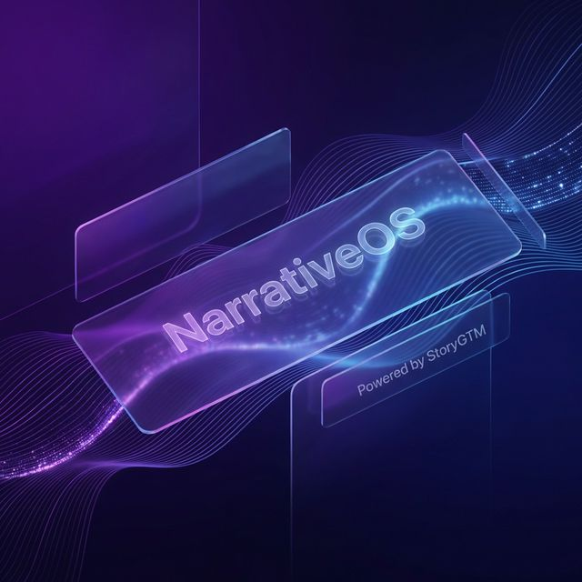
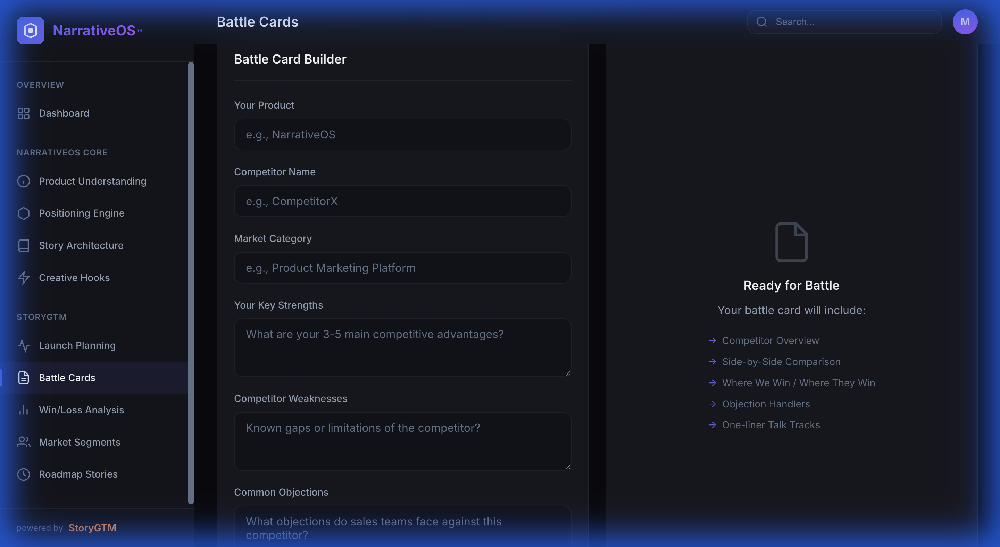

<div align="center">



# NarrativeOS™ — powered by StoryGTM

[](LICENSE)
[](SECURITY.md)
[](https://github.com/Storynova)

### **The Operating System for Product Storytelling and Go-To-Market Clarity.**

<br />

[](https://storynova.github.io/narrativeos/)

<br />

---

### **Platform Interface Preview**


</div>

---

## ✨ Core Pillars

### 🧠 Narrative Intelligence
Extract the "why" behind your product. Convert technical features into customer-centric outcomes using Jobs-to-be-Done (JTBD) frameworks and value mapping.

### 🚀 GTM Orchestration
Plan launches from Alpha to GA with narrative-led sequencing. Ensure every channel—from website to social—speaks with one coherent voice.

### ⚔️ Sales Enablement
Equip sales teams with dynamic battle cards, win/loss pattern analysis, and objection handlers that focus on strategic differentiation.

---

## 🛠️ Create Platform Modules

### NarrativeOS Core
- **Product Understanding Engine**: Transform features into a Feature→Benefit→Outcome matrix.
- **Positioning & Differentiation Engine**: Generate persona-specific positioning statements and competitive grids.
- **Story Architecture Engine**: Frameworks for Origin, Transformation, and Vision stories.
- **Creative Hooks Generator**: 5 levels of magnetic hooks (Emotional, Logical, Provocative, etc.).

### StoryGTM Execution
- **StoryGTM Launch**: Complete GTM planning and launch messaging hierarchies.
- **StoryGTM Sales**: Battle cards, win/loss analysis, and executive talk tracks.
- **StoryGTM Market**: ICP definition, buyer persona creation, and segment narratives.
- **StoryGTM Roadmap**: Bridging the gap between technical progress and customer value stories.

---

## 🔒 Security & Trust

NarrativeOS™ is built for the enterprise. We prioritize data protection and prompt security:
- **Zero-Persistence PII**: Sensitive data stays in your browser session.
- **Prompt Injection Defense**: Multi-layered regex and pattern detection for AI safety.
- **Input Sanitization**: XSS and injection prevention on all form fields.
- **Compliance Ready**: Architectural alignment with SOC-2 and ISO-27001 principles.

---

## 📂 Project Architecture

```text
narrativeos/
├── index.html              # Main Application (Premium Vanilla JS/HTML5)
├── README.md               # Project Overview
├── SECURITY.md             # Detailed Security Policy
├── .gitignore              # Security-Hardened exclusions
│
├── css/
│   └── styles.css          # Design System (Glassmorphism + Dark Mode)
│
├── js/
│   ├── app.js              # Application Controller & Logic
│   └── security.js         # Security & Trust Layer Utilities
│
├── prompts/                # AI Prompt Engineering Hierarchy
│   ├── narrativeos.system.md
│   ├── storygtm.execution.md
│   └── narrativeos.trustlayer.md
│
└── .github/
    └── workflows/          # CI/CD and Security Scanning
```

---

## 🚀 Getting Started

### Prerequisites
- Any modern web browser (Edge, Chrome, Safari, Firefox).
- No server-side setup required for the core UI (Vanilla JS).

### Running Locally
```bash
# Clone the repository
git clone https://github.com/Storynova/narrativeos.git

# Navigate to the directory
cd narrativeos

# Open in browser
open index.html
```

---

## 🤝 Contribution & License

**NarrativeOS™** is a proprietary platform. All rights reserved by **Storynova**.

For collaboration inquiries or enterprise licensing, contact the [Storynova Team](https://github.com/Storynova).

---

**NarrativeOS™** | *Turn complex products into stories that win markets.*
